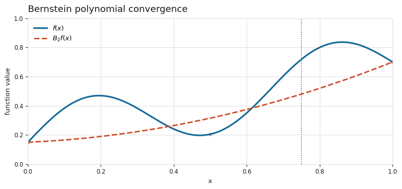

# Proof-Weierstrass-Theorem-Probability
Using probability to solve an analysis problem. Can we approximate any continuous function with polynomials? Or in jargon, for any continuous f : [0, 1] → R and any ε > 0, does there exist a polynomial p(x) such that |f(x) − p(x)| &lt; ε for all x ∈ [0, 1].

## Read the illustrated proof

[Read the full proof with mathematical notation](./bernstein-weierstrass-proof.md), or [open the interactive article](https://pri-arora.github.io/Proof-Weierstrass-Theorem-Probability/).

